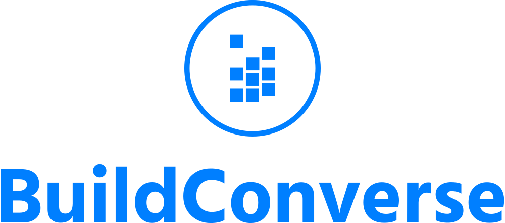

# En cours de développement 

	<h1>CONNECTEZ-VOUS AVEC VOS AMIS ET VOS COMMUNAUTÉS</h1>

 

# Fonctionnalités

### Profil d'utilisateur
Vous pouvez personnaliser votre profil en ajoutant une description et un avatar. Vous pouvez également modifier votre nom d'utilisateur et votre adresse e-mail associée à votre compte. Cela vous permet de vous présenter aux autres utilisateurs de l'application et de rendre votre profil plus personnel.

### Connexion avec les amis

Vous pouvez vous connecter avec vos amis en recherchant leur nom d'utilisateur. Une fois que vous avez ajouté des amis, vous pouvez facilement discuter en privé avec eux. Vous pouvez également supprimer un ami à tout moment si vous le souhaitez.

### Création de communautés

Vous pouvez créer une communauté en choisissant un nom et/ou un avatar et en invitant vos amis à la rejoindre. Dans la communauté, vous pouvez créer des salons de discussion. Vous pouvez également modifier ou supprimer la communauté à tout moment.

### Création de salons de discussion

Vous pouvez créer des salons de discussion pour discuter de différents sujets avec les membres de votre communauté. Vous pouvez glisser-déposer les salons de discussion pour les organiser en fonction de vos préférences. Vous pouvez également modifier ou supprimer le salon à tout moment.

### Messagerie privée

Vous pouvez discuter en privé avec vos amis en utilisant la fonction de messagerie privée. Vous pouvez désactiver une conversation et la réactiver plus tard pour une interface plus propre.

# Tehnos

